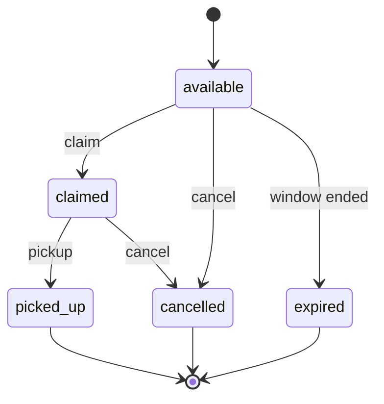

# AI-aided fullstack challenge — MealBridge

**Format:** individual, timeboxed interview-style exercise  
**Duration:** 3 hours  
**Goal:** ship a coherent, demoable vertical slice of a fullstack app using AI coding assistants — and show how you steered those tools with your own agent files, rules, commands, skills, and tests.

This brief is self-contained. You may use any language, framework, or local stack that you can run in the allotted time. You **must** follow the product contract, API contract, TDD rules, and deliverables below. Optional tracks are extra credit, not substitutes for the MVP.

**Optional recommended stack:** if you want a paved path, use **React + TypeScript + Vite** for the frontend and **ASP.NET Core/.NET** for the single backend API, with one .NET project or folder per Clean Architecture responsibility. This is a recommendation, not a requirement; an equivalent stack is valid when it satisfies the same contracts and runs locally.

---

## 0. How to start (first 15 minutes)

1. Create a **new empty git repository** for this challenge (do not reuse a production codebase).
2. Skim this entire brief once. Do not invent extra product scope until the MVP works.
3. Create your AI workspace artifacts **before** generating a lot of code:
   - `AGENTS.md`
   - at least one persistent editor **rule**
   - at least one **command** / prompt
   - **two required skills:** `.agents/skills/tdd/SKILL.md` and `.agents/skills/planning/SKILL.md` ([§8.4](#84-skills-tdd-and-planning-required))
   - `AI-USE.md` (start it now; keep it updated)
4. Write a short implementation plan **using your planning skill** (granular todos; see [§7 TDD](#7-strict-tdd-mandatory) and [§5 Suggested implementation todos](#5-suggested-implementation-todos-copy-into-your-plan)). Pair every behavior change as `*-test-red` then `*-impl`. The TDD skill must be in place before any domain/application `*-impl`.
5. Scaffold the repo (frontend, one API, database, test project) and get an empty app running.
6. Then implement the MVP **test-first**.

You will be evaluated on judgment under time pressure: a working, tested slice beats unfinished breadth.

---

## 1. Product: MealBridge

MealBridge is a fictional **food-rescue coordination** product.

Local businesses (cafés, grocers, bakeries) publish **surplus-food donation lots**. Nonprofit coordinators **claim** a lot for pickup, then mark it **picked up** or **cancelled**. The app exists so edible surplus reaches people instead of landfill.

This is **not** a marketplace, routing engine, or multi-tenant SaaS. It is a single-operator coordination board that one person can demo locally.

### 1.1 Actors (simple, no real auth required)

| Actor | What they do in the demo |
|-------|--------------------------|
| **Donor** | Creates a donation lot (business name, food, quantity, pickup window, location). |
| **Coordinator** | Lists available lots, claims one, updates status to picked up or cancelled. |

You may use a header such as `X-Actor: donor` / `X-Actor: coordinator` or a query/body field `actorName`. Full identity providers, JWT, OAuth, and role-based authorization are **out of scope** for the MVP. Fake names are enough.

### 1.2 Domain object: `DonationLot`

Persist every field below. JSON property names are **camelCase**.

| Field | Type | Required | Notes |
|-------|------|----------|-------|
| `id` | UUID string | yes (server) | Generated on create. |
| `businessName` | string | yes | Donor business. 1–120 chars. |
| `title` | string | yes | Short lot title, e.g. `"Day-old baguettes"`. 1–80 chars. |
| `description` | string | no | Extra notes. Max 500 chars. |
| `foodCategory` | string enum | yes | One of: `bakery`, `produce`, `dairy`, `prepared`, `other`. |
| `quantity` | integer | yes | Number of portions / packs. Must be `>= 1`. |
| `unit` | string enum | yes | One of: `portions`, `kg`, `loaves`, `boxes`. |
| `pickupAddress` | string | yes | Human-readable address. 1–200 chars. |
| `availableFrom` | ISO-8601 datetime | yes | Pickup window start (UTC). |
| `availableUntil` | ISO-8601 datetime | yes | Pickup window end (UTC). Must be **after** `availableFrom`. |
| `status` | string enum | yes (server) | See [§1.3](#13-status-values). Created as `available`. |
| `claimedBy` | string \| null | server | Coordinator display name. `null` until claimed. |
| `claimedAt` | ISO-8601 datetime \| null | server | `null` until claimed. |
| `createdAt` | ISO-8601 datetime | server | Set on create. |
| `updatedAt` | ISO-8601 datetime | server | Set on every mutation. |

Do **not** add extra required fields to the MVP contract. Optional extra fields are allowed if they do not break the examples below.

### 1.3 Status values

| Status | Meaning |
|--------|---------|
| `available` | Listed and unclaimed. |
| `claimed` | A coordinator has reserved it. |
| `picked_up` | Food was collected. Terminal. |
| `cancelled` | Lot withdrawn or claim abandoned. Terminal. |
| `expired` | Window ended while still `available`. Terminal. Optional to auto-compute on read; you may also skip auto-expiry in the MVP if you document that in `AI-USE.md`. |

### 1.4 Allowed transitions

```text
available  → claimed | cancelled | expired
claimed    → picked_up | cancelled
picked_up  → (none)
cancelled  → (none)
expired    → (none)
```

Rules:

- **Claim** is only valid when `status === available`. Success sets `status` to `claimed`, `claimedBy`, and `claimedAt`.
- A second claim on the same lot returns **409**.
- `PATCH .../status` may only apply a transition from the table above. Anything else returns **409**.
- Clients must not set `status` on `POST /api/donations`. The server always creates `available`.



### 1.5 Out of scope (do not build unless time remains after MVP)

- Payments, invoices, tax
- Real maps / GPS routing
- Multi-tenant isolation, Azure AD, JWT
- Email / SMS notifications
- Production cloud deployment
- Multiple backend APIs or microservices
- Perfect UI polish, design systems, or accessibility audits
- Real perishability science or food-safety certification

### 1.6 Mandatory MVP acceptance criteria

The MVP is complete only when **all** of the following are true:

1. One **frontend** and **one backend API** run locally against a **persistent database** (data survives process restart).
2. A donor can **create** a donation lot through the UI; the lot appears in the list.
3. A coordinator can **filter** the list (at least by `status` and `foodCategory`).
4. A coordinator can **claim** an `available` lot from the UI; the lot shows `claimed` and `claimedBy`.
5. A coordinator can mark a claimed lot **picked up** or **cancelled** from the UI.
6. Validation errors (`400`), missing lots (`404`), and illegal claims/transitions (`409`) are visible in the UI (not only in network logs).
7. Core domain/application behavior was built with **strict TDD** ([§7](#7-strict-tdd-mandatory)) and the required tests pass.
8. The backend uses the **simplified Clean Architecture** in [§4.2](#42-simplified-clean-architecture-mandatory): one API host, separate API/Application/Domain/Infrastructure responsibilities, and business invariants owned by the domain.
9. AI workspace artifacts exist ([§8](#8-ai-workspace-artifacts-mandatory)), including **authored** `.agents/skills/tdd/SKILL.md` and `.agents/skills/planning/SKILL.md`.
10. You can complete the [demo script](#113-demo-script-5-minutes) without editing the database by hand.

---

## 2. API contract (exactly one API)

Expose **one** HTTP API. Suggested local base URL: `http://localhost:5080`.

All JSON request and response bodies use **camelCase**.

### 2.1 Response envelope

Every JSON response (success and failure) uses:

```json
{
  "succeeded": true,
  "data": {},
  "error": null
}
```

On failure:

```json
{
  "succeeded": false,
  "data": null,
  "error": "Human-readable message"
}
```

Rules:

- Always check `succeeded` before reading `data`.
- HTTP status codes still apply (`400`, `404`, `409`, `500`, …).
- `error` is a string (not an array). Optional extra `details` inside `data` are allowed for field-level validation, but `error` must remain a single summary string.

### 2.2 Endpoints

| Method | Route | Purpose |
|--------|-------|---------|
| `POST` | `/api/donations` | Create a lot (`available`). |
| `GET` | `/api/donations` | List lots. Query: `status`, `foodCategory` (optional). |
| `GET` | `/api/donations/{id}` | Get one lot. |
| `POST` | `/api/donations/{id}/claim` | Claim an available lot. |
| `PATCH` | `/api/donations/{id}/status` | Apply an allowed status transition. |

Do not add extra **required** routes for the MVP. Health (`GET /health`) and OpenAPI/Swagger are encouraged.

#### `POST /api/donations`

Request:

```json
{
  "businessName": "Northside Bakery",
  "title": "Day-old baguettes",
  "description": "Still good for toast and croutons.",
  "foodCategory": "bakery",
  "quantity": 24,
  "unit": "loaves",
  "pickupAddress": "14 Oak Street, Riverside",
  "availableFrom": "2026-08-14T16:00:00Z",
  "availableUntil": "2026-08-14T20:00:00Z"
}
```

Success: **201 Created** with `data` = the created `DonationLot` (`status` is `available`, `claimedBy` is `null`).

Validation failures: **400** with `succeeded: false`. Required cases:

- missing/blank `businessName`, `title`, `pickupAddress`
- `foodCategory` or `unit` not in the enum
- `quantity < 1`
- `availableUntil` not after `availableFrom`

#### `GET /api/donations`

Success: **200** with `data` = array of `DonationLot` (empty array is valid).

Query parameters (optional, combine with AND):

- `status` — exact enum value
- `foodCategory` — exact enum value

Unknown query values: **400**.

#### `GET /api/donations/{id}`

Success: **200** with `data` = one `DonationLot`.  
Unknown id: **404**.  
Malformed id: **400**.

#### `POST /api/donations/{id}/claim`

Request:

```json
{
  "coordinatorName": "Riverside Food Bank"
}
```

Rules:

- `coordinatorName` required, 1–120 chars.
- Lot must be `available` → **200** (or **201** if you prefer; document it) with updated lot: `status=claimed`, `claimedBy=coordinatorName`, `claimedAt` set.
- Lot not found → **404**.
- Lot not `available` (already claimed, picked up, cancelled, expired) → **409** (`error` explains the conflict).
- Concurrent double-claim of the same lot must not create two successful claims. Last-write-wins that overwrite `claimedBy` is **not** acceptable. Use a transactional check or equivalent.

#### `PATCH /api/donations/{id}/status`

Request:

```json
{
  "status": "picked_up"
}
```

or `{ "status": "cancelled" }`.

Rules:

- Target status must be an allowed transition from the current status → **200** with updated lot.
- Unknown lot → **404**.
- Illegal transition (example: `available` → `picked_up`, or any change from `picked_up`) → **409**.
- Clients cannot set `claimed` through this endpoint; claiming is **only** `POST .../claim`. Sending `status: "claimed"` → **409**.

### 2.3 HTTP status summary

| Code | When |
|------|------|
| **200** | Successful GET / claim / status update |
| **201** | Successful create |
| **400** | Validation, malformed id, unknown query enum |
| **404** | Unknown donation id |
| **409** | Duplicate claim or illegal status transition |
| **500** | Unexpected server error (`error` must not leak secrets) |

### 2.4 CORS and frontend

Allow the frontend origin (for example `http://localhost:5173`) for `GET`, `POST`, `PATCH`, `OPTIONS`. If you reverse-proxy both apps, CORS is optional.

---

## 3. Frontend guidance

Framework is **your choice**. **React + TypeScript + Vite** is the recommended frontend path if you have no strong preference. Vue, Svelte, Angular, Blazor, or a server-rendered UI are all acceptable if you can demo them.

### 3.1 Screens (MVP)

| Screen | Purpose |
|--------|---------|
| **Dashboard / list** | Table or cards of donation lots. Filter by `status` and `foodCategory`. Empty, loading, and error states. |
| **Create lot** | Form for donor fields in [§1.2](#12-domain-object-donationlot). Disable submit while in-flight. Show field errors from `400`. On success, return to the list with the new lot visible. |
| **Detail / workflow** | Show one lot. If `available`, **Claim** (prompt for coordinator name). If `claimed`, actions **Mark picked up** and **Cancel**. Hide illegal actions. Show `409` messages without a blank page. |

A single-page layout (list + side panel) is fine. Routing is optional.

### 3.2 UX states (required)

- **Loading** — spinner or skeleton while fetching.
- **Empty** — “No donation lots yet” (and a different message when filters match nothing).
- **Error** — `error` string from the envelope, plus HTTP status if useful.
- **Success** — toast or inline confirmation after create / claim / status change.
- **Busy buttons** — Claim / Save / Status actions disabled while the request is in flight.

Do not ignore `succeeded === false` just because HTTP is 200 (if that happens, treat it as failure). Prefer trusting both HTTP status and `succeeded`.

### 3.3 API client hints (recommended React/TS)

Keep a small client that unwraps the envelope:

```typescript
export interface ApiResponseEnvelope<T> {
  succeeded: boolean;
  data: T;
  error: string | null;
}

function unwrapEnvelope<T>(body: unknown): T {
  if (
    typeof body === "object" &&
    body !== null &&
    "succeeded" in body &&
    "data" in body
  ) {
    const envelope = body as ApiResponseEnvelope<T>;
    if (!envelope.succeeded) {
      throw new Error(envelope.error ?? "Request failed");
    }
    return envelope.data;
  }
  return body as T;
}
```

Suggested list filters as query params, not a second API:

```http
GET /api/donations?status=available&foodCategory=bakery
```

Polling or SSE is **not** required for the MVP. Reload or refetch after mutations.

### 3.4 Accessibility / layout (lightweight)

- Usable at ~1280px width.
- Labels on every form field.
- Keyboard-submittable forms.
- Do not spend the hour on animations or a design system.

---

## 4. Backend and local infrastructure

### 4.1 Required

- **One** HTTP API process.
- **One** persistent database (SQLite file or local Postgres/SQL Server/LocalDB). In-memory-only stores are **not** enough: restart the API and the created lots must still be there.
- The backend must follow the **simplified Clean Architecture** in [§4.2](#42-simplified-clean-architecture-mandatory).
- No hardcoded secrets (connection strings via env, user secrets, or a local `.env` that is gitignored). Commit a `.env.example`.
- Seed **zero or a few** sample lots only if it helps the demo; the create form must still work.

Recommended default: **SQLite** + your language’s ordinary test runner, so Docker is optional.

Recommended backend path: **ASP.NET Core/.NET** with one API host. This is optional; Node, Python, Java, Go, or another local stack is equally valid when it implements the contract and preserves the required boundaries.

### 4.2 Simplified Clean Architecture (mandatory)

Use one backend host, but organize its code into these responsibilities:

```text
API / Presentation  →  Application  →  Domain
        └──────────── Infrastructure
```

- **API / Presentation:** HTTP routes/controllers, transport DTOs, status-code mapping, CORS, and the response envelope. It translates requests and responses; it does **not** decide business rules.
- **Application:** use cases such as `CreateDonation`, `ClaimDonation`, `ListDonations`, and `ChangeDonationStatus`. It coordinates workflows, ports/interfaces, transactions, and DTO mapping.
- **Domain:** `DonationLot`, status values, transition policy, and invariants. The domain must be testable without HTTP, a database, or an AI service.
- **Infrastructure:** database/ORM mappings, migrations, repositories, and optional queue/storage adapters. Infrastructure implements ports; it must not redefine domain rules.

Keep the dependency direction inward: Domain has no dependency on Infrastructure or HTTP; Application depends on Domain; API and Infrastructure depend on the inner contracts they implement or call. Composition/DI belongs at the API entry point.

### 4.3 Rich domain is rewarded

The MVP must enforce the rules somewhere, but **where** matters. A rich domain implementation scores higher than an anemic CRUD model:

- Put invariants and state changes behind domain behavior such as `DonationLot.Claim(...)`, `DonationLot.ChangeStatus(...)`, and a transition policy/value object.
- Keep illegal transitions and invalid state combinations impossible or rejected by the domain, not only by controllers or frontend checks.
- Keep the Application layer responsible for orchestration and persistence, not for reimplementing every domain rule.
- Value objects for concepts such as pickup windows, quantities, or addresses are welcome when they improve clarity and remain proportional to the three-hour limit.

Do not build a framework-heavy architecture to earn points. A few projects or folders in one repository are enough; separate deployables, CQRS, mediators, event sourcing, and generic abstractions are optional.

An anemic entity with all rules in route handlers or a single CRUD service can still be functional, but it earns less in the [Code quality](#112-scoring-rubric-100) category.

### 4.4 Suggested layout (adapt to your stack)

```text
mealbridge/
  AGENTS.md
  AI-USE.md
  README.md
  .env.example
  .agents/skills/tdd/SKILL.md
  .agents/skills/planning/SKILL.md
  backend/          # one API
  frontend/         # one UI
  tests/            # unit tests next to backend is also fine
```

If you use **ASP.NET Core/.NET**, a typical split is separate projects or folders for `Api` / `Application` / `Domain` / `Infrastructure` plus a unit-test project. If you use Node, use matching folders or packages and keep domain functions testable without spinning HTTP.

### 4.5 Persistence notes

- `id` is a UUID generated server-side.
- Claim must be **atomic** relative to status (`UPDATE ... WHERE status = 'available'` or a transaction with a re-read).
- `updatedAt` changes on create, claim, and status patch.

### 4.6 Optional local infrastructure (not required)

If the MVP is green and time remains, you may add **local** stand-ins:

| Capability | Local stand-in examples |
|------------|-------------------------|
| Queue | Redis list, Azure Storage emulator queue, RabbitMQ, in-process channel + documented worker |
| Worker | Second process or hosted background service consuming `DonationClaimed` |
| Object storage | Local folder, Azurite, MinIO — donation receipt/photo |
| Streams | SSE on `GET /api/donations/{id}/stream` **or** short polling |

Do **not** require cloud accounts. If a dependency cannot run locally in minutes, skip it.

---

## 5. Suggested implementation todos (copy into your plan)

Your own plan must use structured todos (`id` + `content`). Each `content` must name a **file path** and a **concrete action**. For behavior, emit `*-test-red` **before** `*-impl`. End with `verify`.

Copy and adapt this list (paths assume a Node or .NET-style tree — change paths to match your repo):

```yaml
- id: workspace-agents
  content: Create `AGENTS.md` at repo root describing MealBridge, stack, TDD rule, and how to run API/UI/tests.
- id: workspace-rule
  content: Add a persistent editor rule (e.g. `.cursor/rules/tdd.mdc` or `.github/copilot-instructions.md`) that forbids production behavior changes before a failing unit test.
- id: workspace-command
  content: Add at least one command/prompt file (e.g. `.cursor/commands/tdd-implement.md` or `.github/prompts/tdd-implement.md`) describing red → green → refactor.
- id: workspace-skill-tdd
  content: Create `.agents/skills/tdd/SKILL.md` as a reusable strict-TDD skill (red → green → refactor, `*-test-red` before `*-impl`, focused failing-test command, MealBridge-required test intents). Point to it from `AGENTS.md`.
- id: workspace-skill-planning
  content: Create `.agents/skills/planning/SKILL.md` as a reusable planning skill (structured `id` + `content` todos, each todo names a file path and concrete action, TDD pairing, final `verify` todo). Point to it from `AGENTS.md`.
- id: workspace-skill-domain
  content: Optional — add `.agents/skills/mealbridge-domain/SKILL.md` with DonationLot fields, statuses, and allowed transitions from this brief.
- id: architecture-structure
  content: Create the simplified Clean Architecture structure under `backend/` with `Api`/Presentation, `Application`, `Domain`, and `Infrastructure` responsibilities; document inward dependencies and composition in `AGENTS.md`.
- id: create-donation-test-red
  content: In the backend unit test project, add `Create_WhenValid_ReturnsAvailableLot` asserting required fields, `status=available`, and `claimedBy=null`; run the focused test and confirm it fails for the right reason.
- id: create-donation-impl
  content: Implement minimal create-donation application logic so `Create_WhenValid_ReturnsAvailableLot` passes.
- id: create-donation-validation-test-red
  content: Add `Create_WhenQuantityLessThanOne_Rejects` (or equivalent) expecting a validation failure; run focused test; confirm red.
- id: create-donation-validation-impl
  content: Implement quantity / enum / date-window validation so the validation test passes.
- id: claim-test-red
  content: Add `Claim_WhenAvailable_SetsClaimedByAndStatus`; run focused test; confirm red.
- id: claim-impl
  content: Implement claim so the success test passes.
- id: claim-conflict-test-red
  content: Add `Claim_WhenAlreadyClaimed_Conflicts` expecting a conflict/409 domain result; run focused test; confirm red.
- id: claim-conflict-impl
  content: Implement duplicate-claim rejection without overwriting `claimedBy`.
- id: status-transition-test-red
  content: Add `ChangeStatus_WhenAvailableToPickedUp_Conflicts` (illegal transition) and a legal `claimed → picked_up` success test; confirm red.
- id: status-transition-impl
  content: Implement the transition table so legal updates pass and illegal ones conflict.
- id: persistence
  content: Wire the repository/database so lots persist across API restart (SQLite or local Postgres).
- id: http-api
  content: Map the five routes in §2 onto the application services; keep handlers thin; return the envelope.
- id: frontend-list-create
  content: Build list + create form against `GET/POST /api/donations` with loading/empty/error/success states.
- id: frontend-claim-status
  content: Build detail actions for claim and status patch, including visible 409 handling.
- id: verify
  content: Run the backend unit test suite; start API + frontend; execute the demo script in this brief; record evidence in `AI-USE.md`.
```

Do not implement `*-impl` todos before the matching `*-test-red` todo. Do not replace this with a single “build the app” item.

---

## 6. Timebox (3 hours)

| Elapsed | Focus |
|---------|--------|
| **0:00–0:15** | Read brief, init git repo, `AGENTS.md`, TDD + planning skills, high-level plan with todos above. |
| **0:15–0:35** | Scaffold API, DB, frontend, test runner, and the simplified Clean Architecture folders. Empty list page talking to `GET /api/donations`. |
| **0:35–1:45** | TDD the domain/application slices: create, validation, claim, claim conflict, status transitions. Then HTTP + persistence. |
| **1:45–2:25** | Frontend create / list / filter / claim / status. Envelope client. Error states. |
| **2:25–2:45** | Demo rehearsal, README, `AI-USE.md`, seed data if needed. Optional **one** extension only if MVP is solid. |
| **2:45–3:00** | Freeze features. Verify tests. Record how to run. Zip or push the repo. |

If you are behind at **1:45**, skip extensions and even filters beyond `status`. Protect claim + persistence + tests.

---

## 7. Strict TDD (mandatory)

Specs in this brief define **what** to build. Unit tests prove it is done.

### 7.1 Hard rule

Do **not** add or change domain/application behavior until a **failing** unit test exists for that behavior.

Red → green → refactor:

1. **Red** — Write a test named `Method_Scenario_ExpectedResult` (or the equivalent in your runner). Run **only that test**. Confirm it fails for the **right reason** (missing method, assertion failure, `NotImplemented`) — not because the project does not compile due to unrelated edits.
2. **Green** — Write the **minimum** production code to pass that test.
3. **Refactor** — Clean up with the suite still green.

Record in `AI-USE.md` at least one red command output (or a short note of the failure) before the matching implementation.

### 7.2 Minimum tests (must exist and pass)

| Test intent | Example name |
|-------------|--------------|
| Valid create returns `available` lot with server ids/timestamps | `Create_WhenValid_ReturnsAvailableLot` |
| Invalid input is rejected (at least `quantity < 1` **or** `availableUntil` not after `availableFrom`) | `Create_WhenQuantityLessThanOne_Rejects` |
| Claim on `available` sets `claimed` + `claimedBy` + `claimedAt` | `Claim_WhenAvailable_SetsClaimedByAndStatus` |
| Second claim conflicts | `Claim_WhenAlreadyClaimed_Conflicts` |
| Illegal status transition conflicts | `ChangeStatus_WhenAvailableToPickedUp_Conflicts` |

A legal `claimed → picked_up` test is strongly recommended in addition to the illegal-transition test.

These tests must hit **domain or application services** (or pure functions), with persistence mocked or using a lightweight test double. They must **not** be only end-to-end UI tests.

### 7.3 Optional tests

- HTTP/integration tests for `400` / `404` / `409` on the real routes.
- Frontend interaction tests (Testing Library, Playwright, Cypress) for claim + error toast.
- Property tests for the transition table.

Do not spend TDD time on CSS.

### 7.4 Verify order

1. Unit tests for the domain/application project.
2. (Optional) API integration tests.
3. Manual demo script.
4. Note results in `AI-USE.md`.

---

## 8. AI workspace artifacts (mandatory)

You must **author** these for **this** solution. Copy-pasting a generic template with no MealBridge content does not count.

### 8.1 `AGENTS.md` (repo root)

Include at least:

- What MealBridge is (two sentences)
- How to run frontend, API, database, and tests
- Stack choices and module layout
- Non-negotiables: simplified Clean Architecture, rich domain rules, TDD, one API, envelope, no secrets in git
- Pointers to rules, commands, and skills — must link `.agents/skills/tdd/SKILL.md` and `.agents/skills/planning/SKILL.md`

### 8.2 Persistent rules

At least one rule your editor will actually load, for example:

- Cursor: `.cursor/rules/*.mdc`
- VS Code / Copilot: `.github/copilot-instructions.md`
- Other: document the path in `AGENTS.md`

The rule must mention **test-first**, the **MealBridge status machine**, and the simplified Clean Architecture dependency direction.

### 8.3 Commands / prompts

At least one reusable prompt, for example `tdd-implement`, `commit`, or `demo-check`. It should tell the agent to run a focused failing test before editing production code.

### 8.4 Skills (TDD and planning required)

You must **write** these two skills yourself (do not paste a generic “use TDD” one-liner). They must be specific enough that an AI agent can follow them without this challenge brief.

| Required skill | Path | Must include |
|----------------|------|----------------|
| **TDD** | `.agents/skills/tdd/SKILL.md` | When it applies (domain/application behavior). Red → green → refactor steps. Hard rule: no production behavior until a failing unit test exists. Todo pairing `*-test-red` then `*-impl`. How to run a **focused** failing test in your stack. Confirm failure for the right reason. The five MealBridge test intents from [§7.2](#72-minimum-tests-must-exist-and-pass). Anti-patterns (tests last, skipping red confirmation, only E2E tests). |
| **Planning** | `.agents/skills/planning/SKILL.md` | When it applies (Plan Mode / implementation plans). Structured todos with `id` + `content`. Each `content` names a **repo-relative file path** and a **concrete action**. Behavior slices always `*-test-red` before `*-impl`. Final todo is `verify` with exact test/run/demo commands. Anti-patterns (vague “update service”, “add tests”, a single “build the app” todo). |

`AGENTS.md` must route agents to both skills (for example: “behavior change → read `.agents/skills/tdd/SKILL.md`”; “planning / todos → read `.agents/skills/planning/SKILL.md`”).

Optional extra (does not replace the two above): `.agents/skills/mealbridge-domain/SKILL.md` with the field table, enums, and transition rules so you are not re-pasting this brief into every prompt.

### 8.5 `AI-USE.md`

Living log. Minimum sections:

1. **Tools** — editor(s), models, any MCP servers, RAG, embeddings, agents.
2. **Decisions** — three or more bullets (why SQLite vs Postgres, how you kept the architecture proportional, why you skipped an extension, etc.).
3. **TDD evidence** — red then green for the required tests (command + outcome).
4. **Prompts** — 3–8 notable prompts or a pointer to chat exports; what you accepted vs rejected from the model.
5. **What broke** — at least one AI mistake you caught.

Honesty beats theatre. If you wrote a function by hand, say so.

---

## 9. Optional extension tracks

Attempt **at most one** unless the MVP is done and tests are green. Label skipped tracks in `AI-USE.md`.

| Track | What “done” looks like |
|-------|------------------------|
| **Queue** | Publishing a `DonationClaimed` event (`donationId`, `claimedBy`, `claimedAt`) to a local queue; a worker logs or writes an audit row. |
| **Storage** | Optional photo/receipt upload stored locally or in an emulator; lot detail shows it. |
| **Streams** | SSE (or 1s polling fallback) for a lot’s status while the detail view is open. |
| **MCP** | A small MCP server exposing `list_available_donations` and `claim_donation` that you actually connect to the editor. |
| **RAG** | Coordinator help panel that answers from a **local** markdown policy file (pickup rules). Answers must cite the file; no silent hallucination. |
| **Embeddings** | Search lots by free-text similarity (“bread near Oak Street”) over a local index. |
| **Agent** | A pickup-planning helper that proposes an order of `available` lots (heuristic is enough) with a visible rationale. |

Extensions that cannot run offline in the demo do not score.

---

## 10. Safety and professional constraints

- No real personal data. Use fictional businesses and addresses.
- No secrets in git (`web.config`, connection strings, API keys).
- No offensive, illegal, or production-attack content.
- Do not spend time scraping live businesses.
- If you use cloud AI APIs, do not commit keys; `.env` + `.gitignore`.

---

## 11. Deliverables, scoring, demo, shortcuts

### 11.1 Deliverables (end of 3 hours)

| Artifact | Required |
|----------|----------|
| Source repo with frontend + one API + database support | yes |
| Tests for the five intents in [§7.2](#72-minimum-tests-must-exist-and-pass) | yes |
| Backend simplified Clean Architecture with API/Application/Domain/Infrastructure responsibilities | yes |
| `AGENTS.md`, rule(s), command(s), `AI-USE.md` | yes |
| `.agents/skills/tdd/SKILL.md` and `.agents/skills/planning/SKILL.md` | yes |
| `README.md` with run instructions (API, UI, tests, env) | yes |
| `.env.example` | yes |
| Working demo of the script below | yes |
| Optional extension | no |

### 11.2 Scoring rubric (100)

| Area | Points | Looks for |
|------|--------|-----------|
| MVP vertical slice | 30 | Create, list, filter, claim, status, persistence, envelope |
| Strict TDD | 20 | Red-before-green evidence; required tests exist and pass; tests target domain/application |
| AI workspace | 15 | Tailored `AGENTS.md` / rules / commands / `AI-USE.md`; **TDD skill** and **planning skill** present and usable |
| Architecture & code quality | 15 | Simplified Clean Architecture, thin HTTP layer, rich domain rules, no secrets, sensible structure |
| UX / demo | 10 | Loading/empty/error, demo script completes |
| Optional extension | 10 | At most one track, actually runnable |

A broken MVP with a flashy agent/RAG demo scores lower than a complete tested slice.

### 11.3 Demo script (~5 minutes)

1. Show `AGENTS.md`, the `Api`/`Application`/`Domain`/`Infrastructure` structure, then open `.agents/skills/tdd/SKILL.md` and `.agents/skills/planning/SKILL.md` and say how you used them.
2. Open the domain model and point out where claim and status-transition invariants live.
3. Run the unit tests; point at the five required cases.
4. Start API + UI.
5. Create **Northside Bakery / Day-old baguettes** (use the sample payload).
6. Filter list to `available` + `bakery`; open the lot.
7. Claim as **Riverside Food Bank**.
8. Attempt to claim again (or claim in another tab) and show the **409** message.
9. Mark **picked up**. Show that claim/cancel are no longer offered.
10. Restart the API (not the DB) and show the lot is still `picked_up`.
11. If you built an extension, 60 seconds on that only.

### 11.4 Allowed shortcuts

- No real authentication.
- SQLite file in the repo directory (gitignored) or LocalDB.
- Ugly but usable CSS.
- Hardcoded `http://localhost:5080` in the frontend for local demo (document it).
- Skip auto-`expired` if you mention it in `AI-USE.md`.
- Skip Docker.
- Keep all four backend responsibilities in one repository and one API host; separate deployables are not required.

Do **not** shortcut: TDD on the five tests, persistence, envelope, 409 on double-claim, the simplified Clean Architecture responsibilities, rich domain invariants, the AI workspace files, or the required TDD and planning skills.

---

## 12. Submission checklist

Before time expires:

- [ ] `README.md` explains how to run API, UI, tests, and which ports to use
- [ ] `.env.example` exists; secrets are not committed
- [ ] Five required unit tests exist and pass
- [ ] Backend has API/Presentation, Application, Domain, and Infrastructure responsibilities with inward dependencies
- [ ] Domain owns claim and status-transition invariants; controllers/routes do not duplicate them
- [ ] `AI-USE.md` includes red-then-green evidence
- [ ] `AGENTS.md`, at least one rule, one command
- [ ] `.agents/skills/tdd/SKILL.md` and `.agents/skills/planning/SKILL.md` exist and are linked from `AGENTS.md`
- [ ] Demo script works after API restart
- [ ] Envelope used on JSON responses
- [ ] Double-claim returns **409** and does not overwrite `claimedBy`
- [ ] Illegal `available → picked_up` returns **409**
- [ ] Optional extension labeled; MVP not sacrificed for it

---

## 13. Facilitator notes (for the people running the session)

Not for scoring the candidate’s product imagination — the domain is fixed on purpose.

- Candidates work **individually**.
- Internet and AI tools are **allowed and expected**.
- Provide this file only; do not provide a starter repo unless you decide to (default: empty folder).
- At T+3:00, stop coding. Remaining polish does not count.
- Ask each person to narrate one place they **disagreed** with the model.

Good luck. Optimize for an honest, tested vertical slice — not a miniature platform.
