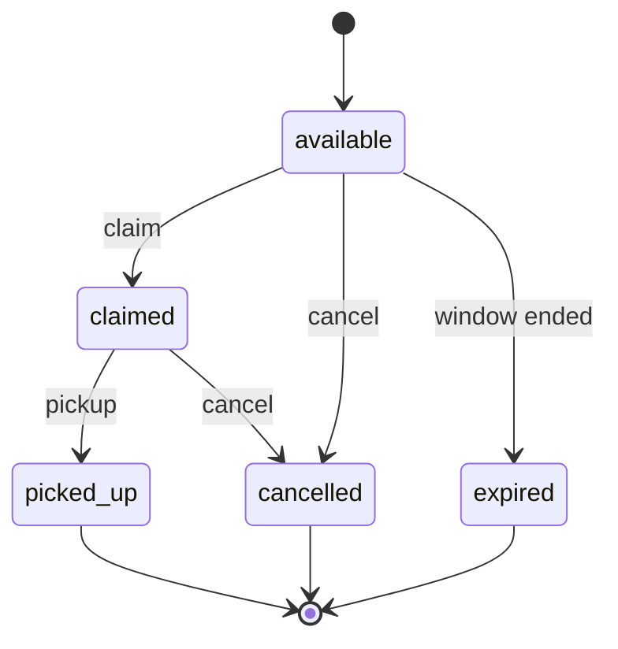

# Reto fullstack asistido por IA — MealBridge

**Formato:** ejercicio individual, con tiempo límite, estilo entrevista  
**Duración:** 3 horas  
**Objetivo:** entregar un corte vertical coherente y demostrable de una aplicación fullstack usando asistentes de código con IA — y mostrar cómo los dirigió con sus propios archivos de agente, reglas, comandos, skills y pruebas.

Este brief es autocontenido. Puede usar el lenguaje, framework o stack local que alcance a correr en el tiempo asignado. **Debe** seguir el contrato de producto, el contrato de API, las reglas de TDD y los entregables de abajo. Las pistas opcionales son puntos extra; **no** reemplazan el MVP.

**Stack opcional recomendado:** si quiere un camino guiado, use **React + TypeScript + Vite** para el frontend y **ASP.NET Core/.NET** para la única API de backend, con un proyecto o carpeta .NET por cada responsabilidad de Arquitectura Limpia. Es una recomendación, no una obligación; un stack equivalente es válido si cumple los mismos contratos y corre en local.

---

## 0. Cómo empezar (primeros 15 minutos)

1. Cree un **repositorio git nuevo y vacío** para este reto (no reutilice un código de producción).
2. Léase este brief completo una vez. No invente alcance extra de producto hasta que el MVP funcione.
3. Cree los artefactos del espacio de trabajo de IA **antes** de generar mucho código:
   - `AGENTS.md`
   - al menos una **regla** persistente del editor
   - al menos un **comando** / prompt
   - **dos skills obligatorias:** `.agents/skills/tdd/SKILL.md` y `.agents/skills/planning/SKILL.md` ([§8.4](#84-skills-tdd-y-planning-obligatorios))
   - `AI-USE.md` (ábralo ya; vaya actualizándolo)
4. Escriba un plan de implementación corto **usando su skill de planning** (todos granulares; vea [§7 TDD](#7-tdd-estricto-obligatorio) y [§5 Todos de implementación sugeridos](#5-todos-de-implementación-sugeridos-cópielos-a-su-plan)). Empareje cada cambio de comportamiento como `*-test-red` y luego `*-impl`. La skill de TDD debe existir antes de cualquier `*-impl` de dominio/aplicación.
5. Arme el esqueleto del repo (frontend, una API, base de datos, proyecto de pruebas) y deje una app vacía corriendo.
6. Luego implemente el MVP **primero con pruebas**.

Se evalúa el criterio bajo presión de tiempo: un corte funcionando y con pruebas vale más que mucho alcance a medias.

---

## 1. Producto: MealBridge

MealBridge es un producto **ficticio de coordinación de rescate de alimentos**.

Negocios locales (cafés, tiendas, panaderías) publican **lotes de donación de comida sobrante**. Coordinadores de organizaciones sin ánimo de lucro **reclaman** un lote para recogerlo y luego lo marcan como **recogido** o **cancelado**. La app existe para que el excedente comestible llegue a personas y no al relleno sanitario.

Esto **no** es un marketplace, un motor de rutas ni un SaaS multi-tenant. Es un tablero de coordinación de un solo operador que una persona pueda demostrar en local.

### 1.1 Actores (simples; no se exige auth real)

| Actor | Qué hace en la demo |
|-------|---------------------|
| **Donante** | Crea un lote de donación (nombre del negocio, comida, cantidad, ventana de recogida, ubicación). |
| **Coordinador** | Lista los lotes disponibles, reclama uno, actualiza el estado a recogido o cancelado. |

Puede usar un header como `X-Actor: donor` / `X-Actor: coordinator` o un campo de query/body `actorName`. Proveedores de identidad, JWT, OAuth y autorización por roles quedan **fuera de alcance** del MVP. Nombres inventados bastan.

### 1.2 Objeto de dominio: `DonationLot`

Persista todos los campos de abajo. Los nombres JSON van en **camelCase** (no los traduzca).

| Campo | Tipo | Obligatorio | Notas |
|-------|------|-------------|-------|
| `id` | string UUID | sí (servidor) | Se genera al crear. |
| `businessName` | string | sí | Negocio donante. 1–120 caracteres. |
| `title` | string | sí | Título corto del lote, p. ej. `"Baguettes del día anterior"`. 1–80 caracteres. |
| `description` | string | no | Notas extra. Máx. 500 caracteres. |
| `foodCategory` | string enum | sí | Uno de: `bakery`, `produce`, `dairy`, `prepared`, `other`. |
| `quantity` | integer | sí | Número de porciones / empaques. Debe ser `>= 1`. |
| `unit` | string enum | sí | Uno de: `portions`, `kg`, `loaves`, `boxes`. |
| `pickupAddress` | string | sí | Dirección legible. 1–200 caracteres. |
| `availableFrom` | datetime ISO-8601 | sí | Inicio de la ventana de recogida (UTC). |
| `availableUntil` | datetime ISO-8601 | sí | Fin de la ventana de recogida (UTC). Debe ser **posterior** a `availableFrom`. |
| `status` | string enum | sí (servidor) | Ver [§1.3](#13-valores-de-estado). Se crea como `available`. |
| `claimedBy` | string \| null | servidor | Nombre visible del coordinador. `null` hasta que se reclame. |
| `claimedAt` | datetime ISO-8601 \| null | servidor | `null` hasta que se reclame. |
| `createdAt` | datetime ISO-8601 | servidor | Se asigna al crear. |
| `updatedAt` | datetime ISO-8601 | servidor | Se actualiza en cada mutación. |

**No** agregue campos extra obligatorios al contrato del MVP. Campos opcionales extra sí se permiten si no rompen los ejemplos de abajo.

### 1.3 Valores de estado

Los valores del enum **no se traducen** en JSON.

| Status | Significado |
|--------|-------------|
| `available` | Listado y sin reclamar. |
| `claimed` | Un coordinador lo reservó. |
| `picked_up` | Ya recogieron la comida. Terminal. |
| `cancelled` | Lote retirado o reclamo abandonado. Terminal. |
| `expired` | Se venció la ventana mientras seguía `available`. Terminal. Es opcional calcularlo al leer; también puede omitir el vencimiento automático en el MVP si lo documenta en `AI-USE.md`. |

### 1.4 Transiciones permitidas

```text
available  → claimed | cancelled | expired
claimed    → picked_up | cancelled
picked_up  → (none)
cancelled  → (none)
expired    → (none)
```

Reglas:

- **Reclamar** solo vale cuando `status === available`. El éxito deja `status` en `claimed`, y llena `claimedBy` y `claimedAt`.
- Un segundo reclamo del mismo lote responde **409**.
- `PATCH .../status` solo puede aplicar una transición de la tabla de arriba. Cualquier otra cosa responde **409**.
- El cliente no debe enviar `status` en `POST /api/donations`. El servidor siempre crea `available`.



### 1.5 Fuera de alcance (no lo arme salvo que sobre tiempo después del MVP)

- Pagos, facturas, impuestos
- Mapas reales / ruteo GPS
- Aislamiento multi-tenant, Azure AD, JWT
- Notificaciones por correo / SMS
- Despliegue a la nube de producción
- Varias APIs de backend o microservicios
- Pulido perfecto de UI, design systems o auditorías de accesibilidad
- Ciencia real de perecederos o certificación sanitaria de alimentos

### 1.6 Criterios de aceptación obligatorios del MVP

El MVP está completo solo cuando **todo** lo siguiente es cierto:

1. Un **frontend** y **una API de backend** corren en local contra una **base de datos persistente** (los datos sobreviven al reiniciar el proceso).
2. Un donante puede **crear** un lote de donación desde la UI; el lote aparece en la lista.
3. Un coordinador puede **filtrar** la lista (al menos por `status` y `foodCategory`).
4. Un coordinador puede **reclamar** un lote `available` desde la UI; el lote muestra `claimed` y `claimedBy`.
5. Un coordinador puede marcar un lote reclamado como **picked_up** o **cancelled** desde la UI.
6. Los errores de validación (`400`), lotes inexistentes (`404`) y reclamos/transiciones ilegales (`409`) se ven en la UI (no solo en los logs de red).
7. El comportamiento de dominio/aplicación se construyó con **TDD estricto** ([§7](#7-tdd-estricto-obligatorio)) y las pruebas exigidas pasan.
8. El backend usa la **Arquitectura Limpia simplificada** de [§4.2](#42-arquitectura-limpia-simplificada-obligatoria): un solo host de API, responsabilidades separadas de API/Application/Domain/Infrastructure y reglas de negocio pertenecientes al dominio.
9. Existen los artefactos del espacio de trabajo de IA ([§8](#8-artefactos-del-espacio-de-trabajo-de-ia-obligatorios)), incluyendo **escritos por usted** `.agents/skills/tdd/SKILL.md` y `.agents/skills/planning/SKILL.md`.
10. Puede completar el [guion de demo](#113-guion-de-demo-5-minutos) sin editar la base de datos a mano.

---

## 2. Contrato de API (exactamente una API)

Exponga **una** API HTTP. URL local sugerida: `http://localhost:5080`.

Todos los bodies JSON de request y response usan **camelCase**.

### 2.1 Sobre (envelope) de respuesta

Toda respuesta JSON (éxito y fallo) usa:

```json
{
  "succeeded": true,
  "data": {},
  "error": null
}
```

En fallo:

```json
{
  "succeeded": false,
  "data": null,
  "error": "Mensaje legible para una persona"
}
```

Reglas:

- Siempre revise `succeeded` antes de leer `data`.
- Los códigos HTTP siguen aplicando (`400`, `404`, `409`, `500`, …).
- `error` es un string (no un arreglo). Se permiten `details` extra opcionales dentro de `data` para validación por campo, pero `error` debe seguir siendo un único resumen en string.

### 2.2 Endpoints

| Método | Ruta | Propósito |
|--------|------|-----------|
| `POST` | `/api/donations` | Crear un lote (`available`). |
| `GET` | `/api/donations` | Listar lotes. Query: `status`, `foodCategory` (opcionales). |
| `GET` | `/api/donations/{id}` | Obtener un lote. |
| `POST` | `/api/donations/{id}/claim` | Reclamar un lote disponible. |
| `PATCH` | `/api/donations/{id}/status` | Aplicar una transición de estado permitida. |

No agregue rutas **obligatorias** extra para el MVP. Health (`GET /health`) y OpenAPI/Swagger se agradece.

#### `POST /api/donations`

Request:

```json
{
  "businessName": "Panadería El Nogal",
  "title": "Baguettes del día anterior",
  "description": "Sirven todavía para tostadas y crotones.",
  "foodCategory": "bakery",
  "quantity": 24,
  "unit": "loaves",
  "pickupAddress": "Calle 79 #11-45, Bogotá",
  "availableFrom": "2026-08-14T16:00:00Z",
  "availableUntil": "2026-08-14T20:00:00Z"
}
```

Éxito: **201 Created** con `data` = el `DonationLot` creado (`status` es `available`, `claimedBy` es `null`).

Fallos de validación: **400** con `succeeded: false`. Casos exigidos:

- `businessName`, `title` o `pickupAddress` faltantes o en blanco
- `foodCategory` o `unit` fuera del enum
- `quantity < 1`
- `availableUntil` no posterior a `availableFrom`

#### `GET /api/donations`

Éxito: **200** con `data` = arreglo de `DonationLot` (arreglo vacío es válido).

Parámetros de query (opcionales, se combinan con AND):

- `status` — valor exacto del enum
- `foodCategory` — valor exacto del enum

Valores de query desconocidos: **400**.

#### `GET /api/donations/{id}`

Éxito: **200** con `data` = un `DonationLot`.  
Id desconocido: **404**.  
Id mal formado: **400**.

#### `POST /api/donations/{id}/claim`

Request:

```json
{
  "coordinatorName": "Banco de Alimentos de Bogotá"
}
```

Reglas:

- `coordinatorName` obligatorio, 1–120 caracteres.
- El lote debe estar `available` → **200** (o **201** si lo prefiere; documente cuál) con el lote actualizado: `status=claimed`, `claimedBy=coordinatorName`, `claimedAt` asignado.
- Lote no encontrado → **404**.
- Lote que no está `available` (ya reclamado, recogido, cancelado, vencido) → **409** (`error` explica el conflicto).
- Un doble reclamo concurrente del mismo lote no puede crear dos reclamos exitosos. Last-write-wins que sobreescriba `claimedBy` **no** es aceptable. Use un chequeo transaccional o equivalente.

#### `PATCH /api/donations/{id}/status`

Request:

```json
{
  "status": "picked_up"
}
```

o `{ "status": "cancelled" }`.

Reglas:

- El estado destino debe ser una transición permitida desde el estado actual → **200** con el lote actualizado.
- Lote desconocido → **404**.
- Transición ilegal (ejemplo: `available` → `picked_up`, o cualquier cambio desde `picked_up`) → **409**.
- El cliente no puede poner `claimed` por este endpoint; reclamar es **solo** `POST .../claim`. Enviar `status: "claimed"` → **409**.

### 2.3 Resumen de códigos HTTP

| Código | Cuándo |
|--------|--------|
| **200** | GET / reclamo / actualización de estado exitosos |
| **201** | Creación exitosa |
| **400** | Validación, id mal formado, enum de query desconocido |
| **404** | Id de donación desconocido |
| **409** | Reclamo duplicado o transición de estado ilegal |
| **500** | Error inesperado del servidor (`error` no debe filtrar secretos) |

### 2.4 CORS y frontend

Permita el origen del frontend (por ejemplo `http://localhost:5173`) para `GET`, `POST`, `PATCH`, `OPTIONS`. Si hace reverse-proxy de ambas apps, CORS es opcional.

---

## 3. Guía de frontend

El framework es **su elección**. **React + TypeScript + Vite** es el camino recomendado para frontend si no tiene una preferencia fuerte. Vue, Svelte, Angular, Blazor o una UI renderizada en servidor también sirven si las puede demostrar.

### 3.1 Pantallas (MVP)

| Pantalla | Propósito |
|----------|-----------|
| **Tablero / lista** | Tabla o tarjetas de lotes de donación. Filtro por `status` y `foodCategory`. Estados vacío, cargando y error. |
| **Crear lote** | Formulario con los campos del donante de [§1.2](#12-objeto-de-dominio-donationlot). Deshabilite el envío mientras la petición va en curso. Muestre errores de campo del `400`. Al éxito, vuelva a la lista con el lote nuevo visible. |
| **Detalle / flujo** | Muestre un lote. Si está `available`, **Reclamar** (pida el nombre del coordinador). Si está `claimed`, acciones **Marcar recogido** y **Cancelar**. Oculte acciones ilegales. Muestre mensajes `409` sin una página en blanco. |

Un layout de una sola página (lista + panel lateral) está bien. El enrutamiento es opcional.

### 3.2 Estados de UX (obligatorios)

- **Cargando** — spinner o skeleton mientras consulta.
- **Vacío** — “Aún no hay lotes de donación” (y un mensaje distinto cuando los filtros no coinciden con nada).
- **Error** — el string `error` del envelope, más el status HTTP si sirve.
- **Éxito** — toast o confirmación en línea después de crear / reclamar / cambiar estado.
- **Botones ocupados** — las acciones Reclamar / Guardar / Estado deshabilitadas mientras la petición va en curso.

No ignore `succeeded === false` solo porque HTTP sea 200 (si pasa, trátalo como fallo). Conviene confiar tanto en el status HTTP como en `succeeded`.

### 3.3 Pistas del cliente de API (React/TS recomendado)

Mantenga un cliente pequeño que desenvuelva el envelope:

```typescript
export interface ApiResponseEnvelope<T> {
  succeeded: boolean;
  data: T;
  error: string | null;
}

function unwrapEnvelope<T>(body: unknown): T {
  if (
    typeof body === "object" &&
    body !== null &&
    "succeeded" in body &&
    "data" in body
  ) {
    const envelope = body as ApiResponseEnvelope<T>;
    if (!envelope.succeeded) {
      throw new Error(envelope.error ?? "Request failed");
    }
    return envelope.data;
  }
  return body as T;
}
```

Filtros de lista sugeridos como query params, no como una segunda API:

```http
GET /api/donations?status=available&foodCategory=bakery
```

Polling o SSE **no** son obligatorios en el MVP. Recargue o vuelva a consultar después de las mutaciones.

### 3.4 Accesibilidad / layout (liviano)

- Usable a ~1280px de ancho.
- Etiquetas en cada campo del formulario.
- Formularios enviables con teclado.
- No se gaste la hora en animaciones ni en un design system.

---

## 4. Backend e infraestructura local

### 4.1 Obligatorio

- **Un** proceso de API HTTP.
- **Una** base de datos persistente (archivo SQLite o Postgres/SQL Server/LocalDB local). Un store solo en memoria **no** alcanza: al reiniciar la API, los lotes creados deben seguir ahí.
- El backend debe seguir la **Arquitectura Limpia simplificada** de [§4.2](#42-arquitectura-limpia-simplificada-obligatoria).
- Sin secretos quemados en código (connection strings por env, user secrets o un `.env` local en gitignore). Haga commit de un `.env.example`.
- Sembrar **cero o unos pocos** lotes de ejemplo solo si ayuda a la demo; el formulario de crear igual debe funcionar.

Default recomendado: **SQLite** + el test runner habitual de su lenguaje, para que Docker sea opcional.

Camino recomendado para backend: **ASP.NET Core/.NET** con un solo host de API. Es opcional; Node, Python, Java, Go u otro stack local también son válidos si implementan el contrato y conservan las fronteras exigidas.

### 4.2 Arquitectura Limpia simplificada (obligatoria)

Use un solo host de backend, pero organice el código en estas responsabilidades:

```text
API / Presentation  →  Application  →  Domain
        └──────────── Infrastructure
```

- **API / Presentation:** rutas/controllers HTTP, DTOs de transporte, mapeo de códigos HTTP, CORS y envelope de respuesta. Traduce requests y responses; **no** decide reglas de negocio.
- **Application:** casos de uso como `CreateDonation`, `ClaimDonation`, `ListDonations` y `ChangeDonationStatus`. Coordina flujos, puertos/interfaces, transacciones y mapeo de DTOs.
- **Domain:** `DonationLot`, valores de estado, política de transiciones e invariantes. El dominio debe poder probarse sin HTTP, base de datos ni servicio de IA.
- **Infrastructure:** mapeos de base de datos/ORM, migraciones, repositorios y adaptadores opcionales de cola/storage. Infrastructure implementa puertos; no redefine reglas del dominio.

Mantenga la dependencia hacia adentro: Domain no depende de Infrastructure ni de HTTP; Application depende de Domain; API e Infrastructure dependen de los contratos internos que implementan o llaman. La composición/DI pertenece al punto de entrada de API.

### 4.3 El dominio rico recibe mayor puntuación

El MVP debe hacer cumplir las reglas en algún lugar, pero **dónde** importa. Una implementación con dominio rico puntúa mejor que un CRUD anémico:

- Ponga invariantes y cambios de estado detrás de comportamientos del dominio como `DonationLot.Claim(...)`, `DonationLot.ChangeStatus(...)` y una policy/value object de transiciones.
- Mantenga las transiciones ilegales y combinaciones de estado inválidas imposibles o rechazadas por el dominio, no solo por controllers o validaciones del frontend.
- Deje que Application se encargue de orquestación y persistencia, no de volver a implementar cada regla del dominio.
- Value objects para conceptos como ventanas de recogida, cantidades o direcciones son bienvenidos si mejoran la claridad y siguen siendo proporcionales al límite de tres horas.

No arme una arquitectura pesada para ganar puntos. Bastan unos pocos proyectos o carpetas en un solo repo; deployables separados, CQRS, mediadores, event sourcing y abstracciones genéricas son opcionales.

Una entidad anémica con todas las reglas en handlers de rutas o en un único CRUD service puede funcionar, pero recibe menos puntuación en la categoría de [Arquitectura y calidad de código](#112-rúbrica-de-puntuación-100).

### 4.4 Layout sugerido (adáptelo a su stack)

```text
mealbridge/
  AGENTS.md
  AI-USE.md
  README.md
  .env.example
  .agents/skills/tdd/SKILL.md
  .agents/skills/planning/SKILL.md
  backend/          # una API
  frontend/         # una UI
  tests/            # pruebas unitarias al lado del backend también está bien
```

Si usa **ASP.NET Core/.NET**, un corte típico es usar proyectos o carpetas separadas para `Api` / `Application` / `Domain` / `Infrastructure` más un proyecto de pruebas unitarias. Si usa Node, use carpetas o paquetes equivalentes y deje las funciones de dominio testeables sin levantar HTTP.

### 4.5 Notas de persistencia

- `id` es un UUID generado en el servidor.
- El reclamo debe ser **atómico** respecto al estado (`UPDATE ... WHERE status = 'available'` o una transacción con relectura).
- `updatedAt` cambia al crear, reclamar y al hacer patch de estado.

### 4.6 Infraestructura local opcional (no es obligatoria)

Si el MVP está en verde y sobra tiempo, puede agregar sustitutos **locales**:

| Capacidad | Ejemplos de sustituto local |
|-----------|----------------------------|
| Cola | Lista de Redis, cola del emulador de Azure Storage, RabbitMQ, canal in-process + worker documentado |
| Worker | Segundo proceso o background service que consuma `DonationClaimed` |
| Object storage | Carpeta local, Azurite, MinIO — foto/recibo de la donación |
| Streams | SSE en `GET /api/donations/{id}/stream` **o** polling corto |

**No** exija cuentas de nube. Si una dependencia no corre en local en minutos, sáltela.

---

## 5. Todos de implementación sugeridos (cópielos a su plan)

Su propio plan debe usar todos estructurados (`id` + `content`). Cada `content` debe nombrar una **ruta de archivo** y una **acción concreta**. Para comportamiento, emita `*-test-red` **antes** de `*-impl`. Termine con `verify`.

Copie y adapte esta lista (las rutas asumen un árbol estilo Node o .NET — cámbielas para que coincidan con su repo):

```yaml
- id: workspace-agents
  content: Crear `AGENTS.md` en la raíz del repo describiendo MealBridge, el stack, la regla de TDD y cómo correr API/UI/pruebas.
- id: workspace-rule
  content: Agregar una regla persistente del editor (p. ej. `.cursor/rules/tdd.mdc` o `.github/copilot-instructions.md`) que prohíba cambios de comportamiento de producción antes de una prueba unitaria en rojo.
- id: workspace-command
  content: Agregar al menos un archivo de comando/prompt (p. ej. `.cursor/commands/tdd-implement.md` o `.github/prompts/tdd-implement.md`) describiendo red → green → refactor.
- id: workspace-skill-tdd
  content: Crear `.agents/skills/tdd/SKILL.md` como skill reutilizable de TDD estricto (red → green → refactor, `*-test-red` antes de `*-impl`, comando de prueba fallida enfocada, intenciones de prueba exigidas de MealBridge). Enlazarla desde `AGENTS.md`.
- id: workspace-skill-planning
  content: Crear `.agents/skills/planning/SKILL.md` como skill reutilizable de planning (todos estructurados `id` + `content`, cada todo nombra una ruta de archivo y una acción concreta, emparejamiento TDD, todo final `verify`). Enlazarla desde `AGENTS.md`.
- id: workspace-skill-domain
  content: Opcional — agregar `.agents/skills/mealbridge-domain/SKILL.md` con campos de DonationLot, estados y transiciones permitidas de este brief.
- id: architecture-structure
  content: Crear la estructura de Arquitectura Limpia simplificada dentro de `backend/` con responsabilidades `Api`/Presentation, `Application`, `Domain` e `Infrastructure`; documentar las dependencias hacia adentro y la composición en `AGENTS.md`.
- id: create-donation-test-red
  content: En el proyecto de pruebas unitarias del backend, agregar `Create_WhenValid_ReturnsAvailableLot` afirmando campos requeridos, `status=available` y `claimedBy=null`; correr la prueba enfocada y confirmar que falla por la razón correcta.
- id: create-donation-impl
  content: Implementar la lógica mínima de crear donación para que `Create_WhenValid_ReturnsAvailableLot` pase.
- id: create-donation-validation-test-red
  content: Agregar `Create_WhenQuantityLessThanOne_Rejects` (o equivalente) esperando un fallo de validación; correr la prueba enfocada; confirmar rojo.
- id: create-donation-validation-impl
  content: Implementar validación de cantidad / enum / ventana de fechas para que la prueba de validación pase.
- id: claim-test-red
  content: Agregar `Claim_WhenAvailable_SetsClaimedByAndStatus`; correr la prueba enfocada; confirmar rojo.
- id: claim-impl
  content: Implementar el reclamo para que la prueba de éxito pase.
- id: claim-conflict-test-red
  content: Agregar `Claim_WhenAlreadyClaimed_Conflicts` esperando un resultado de conflicto/409 de dominio; correr la prueba enfocada; confirmar rojo.
- id: claim-conflict-impl
  content: Implementar el rechazo de reclamo duplicado sin sobreescribir `claimedBy`.
- id: status-transition-test-red
  content: Agregar `ChangeStatus_WhenAvailableToPickedUp_Conflicts` (transición ilegal) y una prueba legal de éxito `claimed → picked_up`; confirmar rojo.
- id: status-transition-impl
  content: Implementar la tabla de transiciones para que las actualizaciones legales pasen y las ilegales entren en conflicto.
- id: persistence
  content: Conectar el repositorio/base de datos para que los lotes persistan al reiniciar la API (SQLite o Postgres local).
- id: http-api
  content: Mapear las cinco rutas del §2 a los application services; dejar los handlers delgados; devolver el envelope.
- id: frontend-list-create
  content: Armar lista + formulario de crear contra `GET/POST /api/donations` con estados de carga/vacío/error/éxito.
- id: frontend-claim-status
  content: Armar acciones de detalle para reclamo y patch de estado, incluyendo manejo visible del 409.
- id: verify
  content: Correr la suite de pruebas unitarias del backend; levantar API + frontend; ejecutar el guion de demo de este brief; registrar evidencia en `AI-USE.md`.
```

No implemente todos `*-impl` antes del `*-test-red` correspondiente. No reemplace esto con un único ítem de “armar la app”.

---

## 6. Timebox (3 horas)

| Tiempo transcurrido | Enfoque |
|---------------------|---------|
| **0:00–0:15** | Leer el brief, init del repo git, `AGENTS.md`, skills de TDD + planning, plan de alto nivel con los todos de arriba. |
| **0:15–0:35** | Esqueleto de API, BD, frontend, test runner y carpetas de Arquitectura Limpia simplificada. Página de lista vacía hablando con `GET /api/donations`. |
| **0:35–1:45** | TDD de los cortes de dominio/aplicación: crear, validación, reclamo, conflicto de reclamo, transiciones de estado. Luego HTTP + persistencia. |
| **1:45–2:25** | Frontend crear / listar / filtrar / reclamar / estado. Cliente del envelope. Estados de error. |
| **2:25–2:45** | Ensayo de demo, README, `AI-USE.md`, datos semilla si hace falta. **Una** extensión opcional solo si el MVP está sólido. |
| **2:45–3:00** | Congelar features. Verificar pruebas. Dejar documentado cómo correr. Zip o push del repo. |

Si va atrasado a las **1:45**, sáltese las extensiones e incluso los filtros más allá de `status`. Proteja reclamo + persistencia + pruebas.

---

## 7. TDD estricto (obligatorio)

Las specs de este brief definen **qué** construir. Las pruebas unitarias demuestran que está hecho.

### 7.1 Regla dura

**No** agregue ni cambie comportamiento de dominio/aplicación hasta que exista una prueba unitaria **en rojo** para ese comportamiento.

Red → green → refactor:

1. **Red** — Escriba una prueba llamada `Method_Scenario_ExpectedResult` (o el equivalente de su runner). Corra **solo esa prueba**. Confirme que falla por la **razón correcta** (método faltante, aserción fallida, `NotImplemented`) — no porque el proyecto no compile por ediciones ajenas.
2. **Green** — Escriba el **mínimo** código de producción para que esa prueba pase.
3. **Refactor** — Limpie con la suite todavía en verde.

Registre en `AI-USE.md` al menos una salida de comando en rojo (o una nota corta del fallo) antes de la implementación correspondiente.

### 7.2 Pruebas mínimas (deben existir y pasar)

| Intención de la prueba | Nombre de ejemplo |
|------------------------|-------------------|
| Crear válido devuelve un lote `available` con ids/timestamps del servidor | `Create_WhenValid_ReturnsAvailableLot` |
| Entrada inválida se rechaza (al menos `quantity < 1` **o** `availableUntil` no posterior a `availableFrom`) | `Create_WhenQuantityLessThanOne_Rejects` |
| Reclamo en `available` deja `claimed` + `claimedBy` + `claimedAt` | `Claim_WhenAvailable_SetsClaimedByAndStatus` |
| Segundo reclamo entra en conflicto | `Claim_WhenAlreadyClaimed_Conflicts` |
| Transición de estado ilegal entra en conflicto | `ChangeStatus_WhenAvailableToPickedUp_Conflicts` |

Se recomienda fuerte una prueba legal `claimed → picked_up` además de la de transición ilegal.

Estas pruebas deben pegarle a **servicios de dominio o aplicación** (o funciones puras), con persistencia mockeada o un test double liviano. **No** pueden ser solo pruebas end-to-end de UI.

### 7.3 Pruebas opcionales

- Pruebas HTTP/integración para `400` / `404` / `409` en las rutas reales.
- Pruebas de interacción de frontend (Testing Library, Playwright, Cypress) para reclamo + toast de error.
- Property tests para la tabla de transiciones.

No se gaste el tiempo de TDD en CSS.

### 7.4 Orden de verificación

1. Pruebas unitarias del proyecto de dominio/aplicación.
2. (Opcional) Pruebas de integración de la API.
3. Guion de demo manual.
4. Anotar resultados en `AI-USE.md`.

---

## 8. Artefactos del espacio de trabajo de IA (obligatorios)

Debe **escribirlos** para **esta** solución. Pegar una plantilla genérica sin contenido de MealBridge no cuenta.

### 8.1 `AGENTS.md` (raíz del repo)

Incluya por lo menos:

- Qué es MealBridge (dos oraciones)
- Cómo correr frontend, API, base de datos y pruebas
- Elección de stack y layout de módulos
- No negociables: Arquitectura Limpia simplificada, reglas de dominio rico, TDD, una API, envelope, sin secretos en git
- Punteros a reglas, comandos y skills — debe enlazar `.agents/skills/tdd/SKILL.md` y `.agents/skills/planning/SKILL.md`

### 8.2 Reglas persistentes

Al menos una regla que su editor vaya a cargar de verdad, por ejemplo:

- Cursor: `.cursor/rules/*.mdc`
- VS Code / Copilot: `.github/copilot-instructions.md`
- Otro: documente la ruta en `AGENTS.md`

La regla debe mencionar **test-first**, la **máquina de estados de MealBridge** y la dirección de dependencias de la Arquitectura Limpia simplificada.

### 8.3 Comandos / prompts

Al menos un prompt reutilizable, por ejemplo `tdd-implement`, `commit` o `demo-check`. Debe indicarle al agente que corra una prueba fallida enfocada antes de editar código de producción.

### 8.4 Skills (TDD y planning obligatorios)

Debe **escribir** estas dos skills usted mismo (no pegue un one-liner genérico de “use TDD”). Tienen que ser lo bastante específicas para que un agente de IA las pueda seguir sin este brief.

| Skill obligatoria | Ruta | Debe incluir |
|-------------------|------|----------------|
| **TDD** | `.agents/skills/tdd/SKILL.md` | Cuándo aplica (comportamiento de dominio/aplicación). Pasos red → green → refactor. Regla dura: nada de comportamiento de producción hasta que exista una prueba unitaria en rojo. Emparejamiento de todos `*-test-red` y luego `*-impl`. Cómo correr una prueba fallida **enfocada** en su stack. Confirmar el fallo por la razón correcta. Las cinco intenciones de prueba de MealBridge de [§7.2](#72-pruebas-mínimas-deben-existir-y-pasar). Anti-patrones (pruebas al final, saltarse la confirmación en rojo, solo pruebas E2E). |
| **Planning** | `.agents/skills/planning/SKILL.md` | Cuándo aplica (Plan Mode / planes de implementación). Todos estructurados con `id` + `content`. Cada `content` nombra una **ruta relativa al repo** y una **acción concreta**. Los cortes de comportamiento siempre `*-test-red` antes de `*-impl`. El todo final es `verify` con comandos exactos de prueba/corrida/demo. Anti-patrones (vago “actualizar servicio”, “agregar pruebas”, un único todo de “armar la app”). |

`AGENTS.md` debe rutar a los agentes hacia ambas skills (por ejemplo: “cambio de comportamiento → leer `.agents/skills/tdd/SKILL.md`”; “planning / todos → leer `.agents/skills/planning/SKILL.md`”).

Extra opcional (no reemplaza las dos de arriba): `.agents/skills/mealbridge-domain/SKILL.md` con la tabla de campos, enums y reglas de transición para no volver a pegar este brief en cada prompt.

### 8.5 `AI-USE.md`

Bitácora viva. Secciones mínimas:

1. **Herramientas** — editor(es), modelos, cualquier servidor MCP, RAG, embeddings, agentes.
2. **Decisiones** — tres o más viñetas (por qué SQLite vs Postgres, cómo mantuvo proporcional la arquitectura, por qué se saltó una extensión, etc.).
3. **Evidencia de TDD** — rojo y luego verde de las pruebas exigidas (comando + resultado).
4. **Prompts** — 3–8 prompts notables o un puntero a exportaciones de chat; qué aceptó vs rechazó del modelo.
5. **Qué se rompió** — al menos un error de la IA que usted cachó.

La honestidad vale más que el teatro. Si escribió una función a mano, dígalo.

---

## 9. Pistas de extensión opcionales

Intente **a lo sumo una** salvo que el MVP esté listo y las pruebas en verde. Marque las pistas omitidas en `AI-USE.md`.

| Pista | Cómo se ve “terminado” |
|-------|------------------------|
| **Cola** | Publicar un evento `DonationClaimed` (`donationId`, `claimedBy`, `claimedAt`) a una cola local; un worker loguea o escribe una fila de auditoría. |
| **Storage** | Carga opcional de foto/recibo guardada en local o en un emulador; el detalle del lote la muestra. |
| **Streams** | SSE (o fallback de polling a 1 s) del estado de un lote mientras la vista de detalle está abierta. |
| **MCP** | Un servidor MCP pequeño exponiendo `list_available_donations` y `claim_donation` que usted **sí** conecte al editor. |
| **RAG** | Panel de ayuda del coordinador que responde desde un archivo markdown de política **local** (reglas de recogida). Las respuestas deben citar el archivo; nada de alucinación silenciosa. |
| **Embeddings** | Buscar lotes por similitud de texto libre (“pan cerca de la Calle 79”) sobre un índice local. |
| **Agente** | Un ayudante de planeación de recogida que proponga un orden de lotes `available` (una heurística alcanza) con una justificación visible. |

Las extensiones que no puedan correr offline en la demo no puntúan.

---

## 10. Seguridad y restricciones profesionales

- Nada de datos personales reales. Use negocios y direcciones ficticios.
- Nada de secretos en git (`web.config`, connection strings, API keys).
- Nada de contenido ofensivo, ilegal o de ataque a producción.
- No se gaste el tiempo scrapeando negocios reales.
- Si usa APIs de IA en la nube, no haga commit de las keys; `.env` + `.gitignore`.

---

## 11. Entregables, puntuación, demo, atajos

### 11.1 Entregables (al cabo de 3 horas)

| Artefacto | Obligatorio |
|-----------|-------------|
| Repo fuente con frontend + una API + soporte de base de datos | sí |
| Pruebas de las cinco intenciones de [§7.2](#72-pruebas-mínimas-deben-existir-y-pasar) | sí |
| Backend con Arquitectura Limpia simplificada y responsabilidades de API/Application/Domain/Infrastructure | sí |
| `AGENTS.md`, regla(s), comando(s), `AI-USE.md` | sí |
| `.agents/skills/tdd/SKILL.md` y `.agents/skills/planning/SKILL.md` | sí |
| `README.md` con instrucciones para correr (API, UI, pruebas, env) | sí |
| `.env.example` | sí |
| Demo funcionando del guion de abajo | sí |
| Extensión opcional | no |

### 11.2 Rúbrica de puntuación (100)

| Área | Puntos | Se busca |
|------|--------|----------|
| Corte vertical del MVP | 30 | Crear, listar, filtrar, reclamar, estado, persistencia, envelope |
| TDD estricto | 20 | Evidencia de rojo-antes-de-verde; las pruebas exigidas existen y pasan; apuntan a dominio/aplicación |
| Espacio de trabajo de IA | 15 | `AGENTS.md` / reglas / comandos / `AI-USE.md` a la medida; **skill de TDD** y **skill de planning** presentes y usables |
| Arquitectura y calidad de código | 15 | Arquitectura Limpia simplificada, capa HTTP delgada, reglas de dominio rico, sin secretos, estructura razonable |
| UX / demo | 10 | Carga/vacío/error, el guion de demo se completa |
| Extensión opcional | 10 | A lo sumo una pista, realmente ejecutable |

Un MVP roto con una demo llamativa de agente/RAG puntúa menos que un corte completo y con pruebas.

### 11.3 Guion de demo (~5 minutos)

1. Muestre `AGENTS.md`, la estructura `Api`/`Application`/`Domain`/`Infrastructure`, luego abra `.agents/skills/tdd/SKILL.md` y `.agents/skills/planning/SKILL.md` y cuente cómo las usó.
2. Abra el modelo de dominio y señale dónde viven las invariantes de reclamo y transición de estado.
3. Corra las pruebas unitarias; señale los cinco casos exigidos.
4. Levante API + UI.
5. Cree **Panadería El Nogal / Baguettes del día anterior** (use el payload de ejemplo).
6. Filtre la lista a `available` + `bakery`; abra el lote.
7. Reclame como **Banco de Alimentos de Bogotá**.
8. Intente reclamar de nuevo (o reclame en otra pestaña) y muestre el mensaje **409**.
9. Marque **picked up**. Muestre que ya no se ofrecen reclamar/cancelar.
10. Reinicie la API (no la BD) y muestre que el lote sigue `picked_up`.
11. Si armó una extensión, 60 segundos solo en eso.

### 11.4 Atajos permitidos

- Sin autenticación real.
- Archivo SQLite en el directorio del repo (en gitignore) o LocalDB.
- CSS feo pero usable.
- `http://localhost:5080` quemado en el frontend para la demo local (documente).
- Saltar el auto-`expired` si lo menciona en `AI-USE.md`.
- Saltar Docker.
- Mantener las cuatro responsabilidades del backend en un solo repositorio y un solo host de API; no se exigen deployables separados.

**No** se ataje: TDD de las cinco pruebas, persistencia, envelope, 409 en doble reclamo, las responsabilidades de Arquitectura Limpia simplificada, las invariantes del dominio rico, los archivos del espacio de trabajo de IA, ni las skills obligatorias de TDD y planning.

---

## 12. Lista de chequeo de entrega

Antes de que se acabe el tiempo:

- [ ] El `README.md` explica cómo correr API, UI, pruebas y qué puertos usar
- [ ] Existe `.env.example`; los secretos no están en commit
- [ ] Existen y pasan las cinco pruebas unitarias exigidas
- [ ] El backend tiene responsabilidades de API/Presentation, Application, Domain e Infrastructure con dependencias hacia adentro
- [ ] Domain es dueño de las invariantes de reclamo y transición de estado; controllers/rutas no las duplican
- [ ] `AI-USE.md` incluye evidencia de rojo-luego-verde
- [ ] `AGENTS.md`, al menos una regla, un comando
- [ ] Existen `.agents/skills/tdd/SKILL.md` y `.agents/skills/planning/SKILL.md` y están enlazadas desde `AGENTS.md`
- [ ] El guion de demo funciona después de reiniciar la API
- [ ] Se usa el envelope en las respuestas JSON
- [ ] El doble reclamo responde **409** y no sobreescribe `claimedBy`
- [ ] `available → picked_up` ilegal responde **409**
- [ ] La extensión opcional está marcada; el MVP no se sacrificó por ella

---

## 13. Notas para quien facilita (quienes corren la sesión)

No se puntúa la imaginación de producto del candidato: el dominio está fijo a propósito.

- Los candidatos trabajan **de forma individual**.
- Internet y herramientas de IA están **permitidos y se esperan**.
- Entregue solo este archivo; no entregue un repo starter salvo que lo decidan (default: carpeta vacía).
- A las T+3:00, se para de codear. El pulido que quede no cuenta.
- Pídale a cada persona que narre un lugar en el que **no estuvo de acuerdo** con el modelo.

Suerte. Optimice por un corte vertical honesto y con pruebas — no por una plataforma en miniatura.
